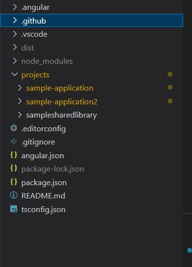
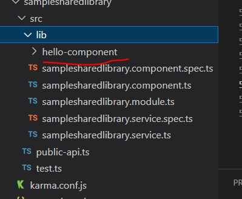
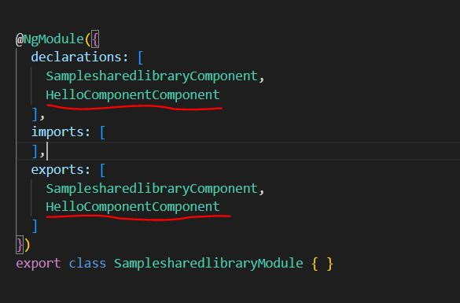
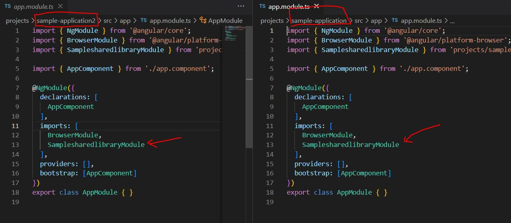

# RamsWorkspace

This project was generated with [Angular CLI](https://github.com/angular/angular-cli) version 14.2.5.

## Anguloar Workspace

This project has been created using [Angular Multi-project Workspace Environment](https://angular.io/guide/file-structure#setting-up-for-a-multi-project-workspace).

## Project Structure 




# Project #1:   sample-application
A sample application using angular 
# Project #2:   sample-application2
A sample application using angular 
# Shared Lib:   samplesharedlib
Shared library contains components shared between the two components


# Angular Code to create application and shared lib

## 1. Create WorkSpace 

    The following command creates the empty workspace application.

 ```
 ng new rams-workspace --no-create-application
 ```

## 2. Create  Application-1 and Application-2

    The following command creates the  application.

 ```
  ng generate application application1
  ng generate application application2
 ```

 ## 3. Create Shared Library

 ```
ng g library firstlibrary
 ```

 ## 4.Create a component in the applications 

 ```
ng generate component firstComponent  --project=application1
 ``` 

## 5.Create a component in the library
```
ng g c HelloComponent --project=firstlibrary  
```
The above comment creates the component in the library




Export the same in the module, to be consumed in the application





Consume the same in the application as normal 

